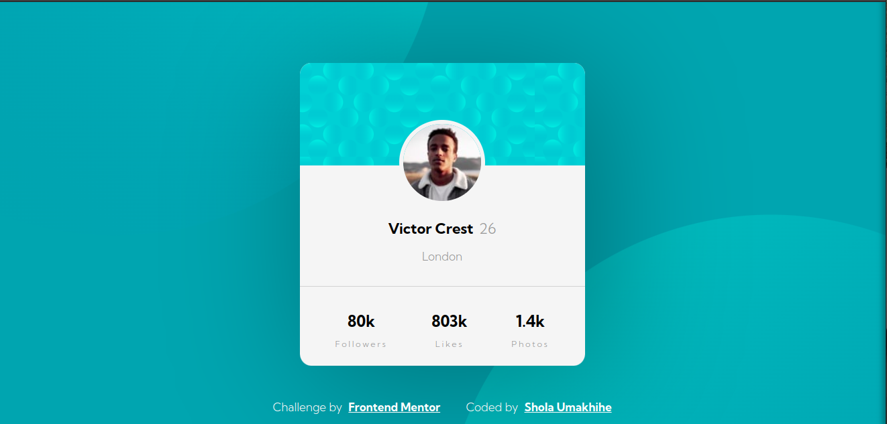

# Frontend Mentor - Profile card component solution

This is a solution to the [Profile card component challenge on Frontend Mentor](https://www.frontendmentor.io/challenges/profile-card-component-cfArpWshJ). Frontend Mentor challenges help you improve your coding skills by building realistic projects.

## Table of contents

- [Overview](#overview)
  - [The challenge](#the-challenge)
  - [Screenshot](#screenshot)
  - [Links](#links)
- [My process](#my-process)
  - [Built with](#built-with)
  - [What I learned](#what-i-learned)
  - [Continued development](#continued-development)
  - [Useful resources](#useful-resources)
- [Author](#author)

## Overview

### The challenge

- Build out the project to the designs provided

### Screenshot

### Links

- Solution URL: [Add solution URL here](https://www.frontendmentor.io/solutions/profile-card-component-with-html-and-css-PpmHxmFOHo)
- Live Site URL: [Add live site URL here](https://jayumaks.github.io/profile-card-component/)

## My process

### Built with

- Semantic HTML5 markup
- CSS custom properties
- SASS
- Flexbox

### What I learned

General CSS practice, but more specifically think I'm starting to get the hang of Flexbox.

### Continued development

- Couldn't get the images to stay in a fixed position. Need to get better at this kind of placement.
- More flexbox practice. Also could this be refactored to use CSS Grid? What are the pros and cons of Flexbox vs CSS Grid? When to use each?

### Useful resources

- [Fjolt](https://fjolt.com/article/a-guide-to-css-flexbox) - This helped me get the hang of Flex Box.

## Author

- Website - [Shola Umakhihe](https://www.your-site.com)
- Frontend Mentor - [@jayumaks](https://www.frontendmentor.io/profile/jayumaks
- Twitter - [@jayumaks](https://www.twitter.com/jayumaks)
